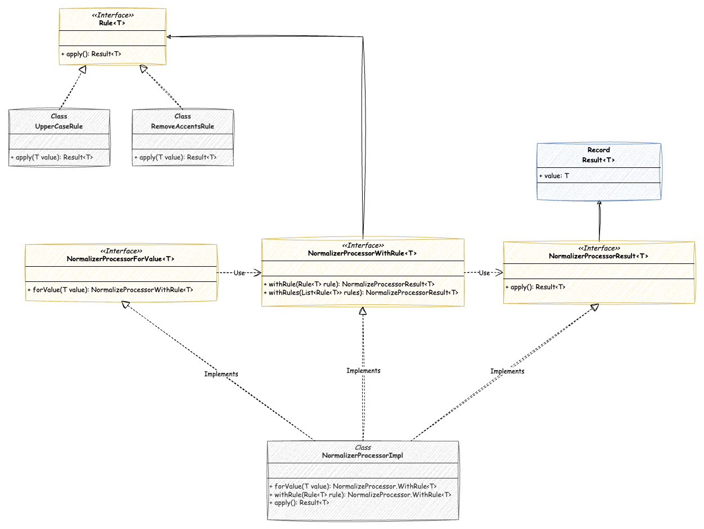

# Data Normalizer

Data Normalizer é uma simples biblioteca que permite aplicar regras de normalização de dados para determinado input, como remoção de acentos de nomes, verificação de emails etc. A ideia é que a estrutura seja extensível para que implementações customizadas possam ser adicionadas de acordo com a necessidade do desenvolvedor que estiver usando a biblioteca.

## Estrutura

A atual estrutura é a seguinte:


## Como usar

### Aplicando uma única `Rule`

Neste cenário, para simplificar aplicaremos uma regra já incluída na biblioteca que transforma uma string em uppercase, para isso devemos fazer o seguinte:

```java

var value = "abcde";
var result = new NormalizeProcessorImpl<String>()
                .forValue(value)
                .withRule(new UpperCaseRule())
                .apply();

// result será "ABCDE"
```

A classe `UpperCaseRule` implementa a interface `Rule<T>` para que seja possível a sua utilização no `NormalizeProcessorImpl` .

### Aplicando múltiplas `Rule`

É possível aplicar uma lista de `Rules` de forma sequencial para determinado valor, exemplo:

```java
var value = "São Paulo";
var result = new NormalizeProcessorImpl<String>()
                .forValue(value)
                .withRules(List.of(new RemoveAccentsRule(), new UpperCaseRule()))
                .apply();

// result será "SAO PAULO"
```

No cenário acima para o input `São Paulo` primeiro vamos aplicar a rule de remoção de acentos para depois transformar o resultado em uppercase, de forma sequencial.

### Criando sua própria `Rule`

O `NormalizeProcessorImpl` consegue trabalhar com qualquer implementação da interface `Rule` , sendo assim, para customizar seu uso basta criar sua própria rule:

```java
public interface Rule<T> {
    Result<T> apply(T value);
}
```

```java
public class UpperCaseRule implements Rule<String> {
    @Override
    public Result<String> apply(String value) {
        return new Result<>(value.toUpperCase());
    }
}
```